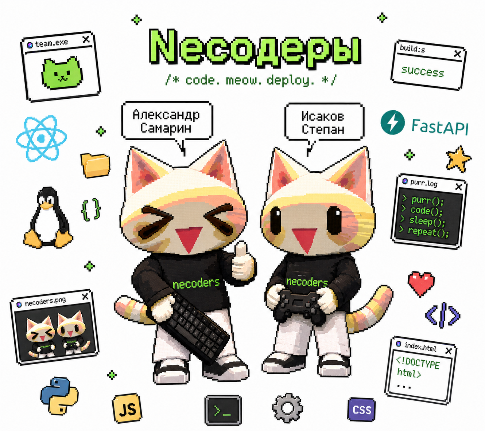

<div align="center">

  

  <h1>Конструктор аналитических выборок</h1>

  <p>
    <b>Интеллектуальный отбор данных для бюджетного планирования</b>
  </p>

  <p>
    Единое пространство для анализа бюджета: быстрый поиск объектов, интерактивные дашборды и атомарная статистика без ручной склейки таблиц.
  </p>

  <p>
    
    
    
  </p>

</div>

---

## О команде

Мы — команда **Некодеры**. 

Мы объединяем продуктовый дизайн, строгую программную инженерию и внимательное отношение к пользовательскому опыту. Наша философия — превращать массивы данных в прозрачные, визуально чистые и удобные профессиональные инструменты, помогающие специалистам принимать решения, а не бороться с интерфейсом.

### Состав

| Участник | Основная зона ответственности |
| :--- | :--- |
| **Самарин Александр** | UX/UI Дизайн, проектирование интерфейсов и анализ пользовательского опыта |
| **Исаков Степан** | Архитектура системы, Backend & Frontend разработка, развертывание |

## Основная идея решения

> **Интеллектуальный отбор данных: Конструктор выборок для бюджетного планирования**

Традиционная работа с бюджетными выгрузками — это часы ручной склейки сотен файлов, поиск разрозненных кодов и высокий риск возникновения ошибок. 

Наш проект решает эту проблему, предлагая «единый пункт управления». Система выступает в роли умного агрегатора: она эффективно «проглатывает» массивы данных из различных источников (**бюджетная роспись, соглашения, государственное задание, выгрузки БУАУ**), нормализует их и автоматически связывает в единую модель.

**Ключевые возможности платформы:**

- 🧠 **Умный импорт и связывание:** Загрузка тяжелых CSV-файлов из разных информационных систем с привязкой сущностей по бюджетным кодам и идентификаторам объектов.
- 🔍 **Сквозной и точный поиск:** Поиск по сотням объектов инфраструктуры за миллисекунды (по коду, названию, метаданным).
- 📊 **Наглядная аналитика:** Визуальное сопоставление плановых бюджетов, кассовых расходов, контрактов, обязательств и фактических платежей через интерактивные графики.
- ⏳ **Срезы в динамике:** Сравнение финансовых показателей по конкретным датам и выбранным историческим периодам для обнаружения трендов.
- 🚀 **Мгновенный экспорт:** Выгрузка сформированных и отфильтрованных аналитических отчетов в формате Excel в один клик.

## Архитектура и стек проекта

| Компонент | Технологии | Роль в проекте |
| :--- | :--- | :--- |
| `frontend/` | React, TypeScript, Vite | Реактивный и отзывчивый UI конструктора выборок |
| `backend/` | Flask, API, Pydantic, SQLAlchemy | Высокопроизводительная логика, обработка отчетов и аналитика |
| `docs/` | Markdown | Подробные технические спецификации и логика компонентов |
| `Инфраструктура` | Docker, Linux, РЕД ОС | Единая Docker-сборка UI и API для быстрого запуска |

Подробная документация находится в папке [docs](./docs/). Фундаментальные архитектурные решения описаны в файле [ARCHITECTURE.md](./docs/ARCHITECTURE.md).

## Инструкция по запуску

### Быстрый старт (Windows)

Мы подготовили автоматизированные скрипты для развёртывания среды разработки:

```powershell
prepare.cmd
dev.cmd
```

*🌐 Frontend будет доступен на `http://localhost:5173` | ⚙️ API - на `http://localhost:5000`*

### Старт разработки (Linux / РЕД ОС)

```bash
chmod +x ./prepare.sh ./dev.sh
./prepare.sh
./dev.sh
```

### Развертывание в Production (Docker / РЕД ОС)

Проект полностью упакован в единый Docker-контейнер и готов к эксплуатации:

```bash
docker build -t constructor-analytics .
docker run -p 8080:8080 -v $(pwd)/data:/data constructor-analytics
```

*После запуска и инициализации среды, платформа доступна по адресу `http://localhost:8080`.*

---

<div align="center">

  <b>Создано командой Некодеры</b>

</div>
